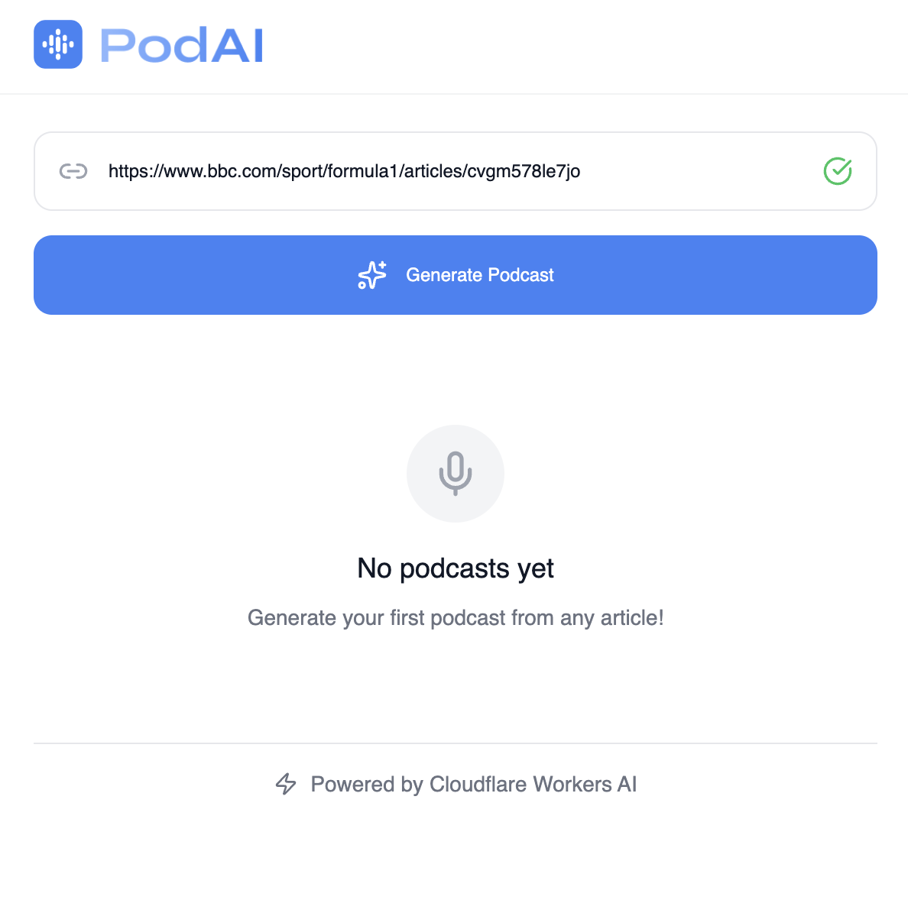
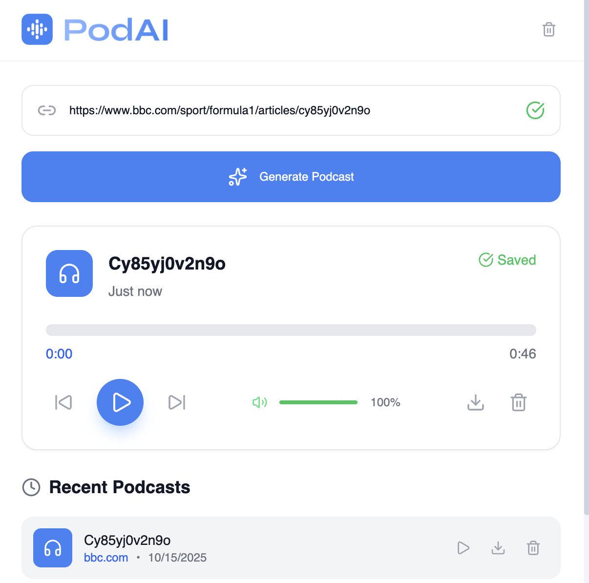

# PodAI - News to Podcast Converter

<div align="center">


**Transform any news article into an AI-powered podcast in seconds!**

[](https://workers.cloudflare.com/)
[](https://nextjs.org/)
[](https://elevenlabs.io/)
[](https://chrome.google.com/webstore)

</div>

---

## Features

- **Instant Conversion**: Transform news articles into podcasts in under 30 seconds
- **High-Quality Audio**: Powered by ElevenLabs AI voice synthesis
- **Smart Summarization**: Cloudflare Workers AI processes content intelligently
- **Chrome Extension**: Seamless browser integration
- **Auto-Save**: Podcasts automatically saved to Recent Podcasts
- **Modern UI**: Clean, responsive design with Syne typography
- **Real-time Progress**: Live updates during generation
- **Volume Control**: Dynamic color-coded volume slider
- **Website Detection**: Shows source website and time ago

---

## Application Screenshots

### How PodAI Works in Action

Here's a visual walkthrough of PodAI transforming news articles into podcasts:

#### Step 1: Extension Interface


**What you see:**
- Clean, modern Chrome extension popup interface
- PodAI logo and branding
- "Generate Podcast" button ready for action
- Current website detection showing the source
- Recent Podcasts section for easy access to previous conversions

**How it works:**
1. Navigate to any news article in your browser
2. Click the PodAI extension icon in your toolbar
3. The extension automatically detects the current webpage
4. Click "Generate Podcast" to start the conversion process

#### Step 2: Podcast Generation & Player


**What you see:**
- Real-time progress indicator showing generation status
- Professional podcast player with play/pause controls
- Dynamic progress bar with current playback position
- Volume control with color-coded slider (red/yellow/green)
- Time display showing current time and total duration
- Download button to save the podcast as MP3
- Article title and summary displayed above the player

**How it works:**
1. The extension scrapes the article content
2. Cloudflare Workers AI processes and summarizes the content
3. ElevenLabs TTS converts the summary to high-quality audio
4. The audio is automatically saved to Cloudflare R2 storage
5. The podcast player loads and is ready for immediate playback

### Complete Workflow

```
News Article → AI Processing → Podcast Generation → Audio Player
     ↓              ↓              ↓              ↓
1. Click Extension  2. Content     3. TTS         4. Instant
   Icon             Scraping       Conversion     Playback
                    & Summarization & Storage      & Download
```

### Key Features Demonstrated

- **Instant Conversion**: From article to podcast in under 30 seconds
- **High-Quality Audio**: Professional-grade voice synthesis
- **Smart UI**: Intuitive controls with visual feedback
- **Auto-Save**: Podcasts automatically saved to Recent Podcasts
- **Modern Design**: Clean, professional interface
- **Real-time Updates**: Live progress indicators during generation

---

## Architecture

```
┌─────────────────┐    ┌──────────────────┐    ┌─────────────────┐
│   Chrome        │    │   Cloudflare     │    │   ElevenLabs    │
│   Extension     │◄──►│   Workers        │◄──►│   TTS API       │
│   (Frontend)    │    │   (Backend)      │    │   (Audio)       │
└─────────────────┘    └──────────────────┘    └─────────────────┘
         │                       │                       │
         │                       ▼                       │
         │              ┌──────────────────┐             │
         │              │   Cloudflare     │             │
         └─────────────►│   Workers AI     │◄────────────┘
                        │   (Summarization)│
                        └──────────────────┘
                                 │
                                 ▼
                        ┌──────────────────┐
                        │   Cloudflare     │
                        │   R2 Storage     │
                        │   (Audio Files)  │
                        └──────────────────┘
```

---

## Quick Start

### Prerequisites

- Node.js 18+ 
- Chrome Browser
- Cloudflare Account
- ElevenLabs Account

### Backend Setup (Cloudflare Workers)

```bash
# Navigate to backend directory
cd Clodflare-Backend

# Install dependencies
npm install

# Configure environment variables
cp wrangler.toml.example wrangler.toml
```

**Configure `wrangler.toml`:**
```toml
name = "podcast-worker"
main = "src/index.js"
compatibility_date = "2024-01-01"

[vars]
ALLOWED_ORIGINS = "*"
ELEVENLABS_API_KEY = "your-elevenlabs-api-key"
ELEVENLABS_VOICE_ID = "21m00Tcm4TlvDq8ikWAM"

[[r2_buckets]]
binding = "AUDIO_BUCKET"
bucket_name = "podcast-audio"

[[d1_databases]]
binding = "PODCAST_DB"
database_name = "podcast-db"
database_id = "your-database-id"

[[ai]]
binding = "AI"
```

**Deploy the backend:**
```bash
# Deploy to Cloudflare Workers
npm run deploy

# Initialize database
npm run init-db
```

### Frontend Setup (Chrome Extension)

```bash
# Navigate to frontend directory
cd Cloudflare-Frontend

# Install dependencies
npm install

# Update API endpoint
# Edit src/lib/constants.js
export const WORKER_URL = 'https://your-worker.your-subdomain.workers.dev';

# Build the extension
npm run build
```

### Chrome Extension Installation

1. Open Chrome and go to `chrome://extensions/`
2. Enable **Developer Mode** (toggle in top-right)
3. Click **Load unpacked**
4. Select the `Cloudflare-Frontend/out` directory
5. PodAI extension is now installed!

---

## Configuration

### Environment Variables

#### Backend (`wrangler.toml`)
```toml
[vars]
ALLOWED_ORIGINS = "*"                    # CORS origins
ELEVENLABS_API_KEY = "sk-..."           # Your ElevenLabs API key
ELEVENLABS_VOICE_ID = "21m00Tcm4TlvDq8ikWAM"  # Voice ID
```

#### Frontend (`src/lib/constants.js`)
```javascript
export const WORKER_URL = 'https://your-worker.your-subdomain.workers.dev';
```

### Database Schema

The extension uses Cloudflare D1 SQLite database with the following schema:

```sql
CREATE TABLE IF NOT EXISTS podcasts (
    id INTEGER PRIMARY KEY AUTOINCREMENT,
    url TEXT UNIQUE NOT NULL,
    title TEXT NOT NULL,
    summary TEXT NOT NULL,
    audioFileName TEXT NOT NULL,
    audioUrl TEXT NOT NULL,
    userId TEXT NOT NULL,
    status TEXT DEFAULT 'completed',
    processingTimeMs INTEGER,
    contentLength INTEGER,
    summaryLength INTEGER,
    audioSizeBytes INTEGER,
    cacheKey TEXT UNIQUE NOT NULL,
    createdAt DATETIME DEFAULT CURRENT_TIMESTAMP
);

CREATE TABLE IF NOT EXISTS processing_logs (
    id INTEGER PRIMARY KEY AUTOINCREMENT,
    podcast_id INTEGER,
    url TEXT NOT NULL,
    error_type TEXT NOT NULL,
    error_message TEXT NOT NULL,
    stack_trace TEXT,
    created_at DATETIME DEFAULT CURRENT_TIMESTAMP,
    FOREIGN KEY (podcast_id) REFERENCES podcasts (id)
);
```

---

## Usage Guide

### How to Use PodAI

1. **Navigate to any news article** in your Chrome browser
2. **Click the PodAI extension icon** in your toolbar
3. **Click "Generate Podcast"** - the extension will:
   - Scrape the article content
   - Generate an AI summary
   - Create audio using ElevenLabs TTS
   - Auto-save to Recent Podcasts
4. **Play your podcast** directly in the extension or download it

### Podcast Player Features

- **Play/Pause Controls**: Click the play button to start/stop
- **Progress Bar**: Shows current position and total duration
- **Volume Control**: Dynamic color-coded slider (red/yellow/green)
- **Time Display**: Current time and total duration
- **Download**: Save podcast as MP3 file
- **Recent Podcasts**: View and replay previous podcasts

### UI Features

- **Modern Design**: Clean, professional interface
- **Syne Typography**: Custom font family for better readability
- **Dynamic Colors**: Volume slider changes color based on level
- **Responsive Layout**: Works perfectly in extension popup
- **Smooth Animations**: Framer Motion powered transitions

---

## Development

### Backend Development

```bash
cd Clodflare-Backend

# Start local development
wrangler dev

# Run tests
npm test

# Deploy to staging
wrangler deploy --env staging
```

### Frontend Development

```bash
cd Cloudflare-Frontend

# Start development server
npm run dev

# Build for production
npm run build

# Test extension
npm run test
```

### Project Structure

```
CloudFlare/
├── Clodflare-Backend/           # Cloudflare Workers backend
│   ├── src/
│   │   ├── index.js            # Main worker entry point
│   │   ├── workflow.js         # Workflow orchestration
│   │   ├── database.js         # Database operations
│   │   ├── ai-helper.js        # AI summarization
│   │   ├── scraper.js          # Web scraping
│   │   └── utils.js            # Utility functions
│   ├── wrangler.toml           # Cloudflare configuration
│   └── package.json
│
└── Cloudflare-Frontend/         # Chrome Extension frontend
    ├── src/
    │   ├── pages/
    │   │   └── popup.jsx       # Main extension popup
    │   ├── components/
    │   │   ├── PodcastPlayer.jsx # Audio player component
    │   │   ├── HistoryList.jsx   # Recent podcasts list
    │   │   └── ErrorDisplay.jsx  # Error handling
    │   ├── hooks/
    │   │   ├── usePodcastGenerator.js # Podcast generation logic
    │   │   └── useHistory.js        # History management
    │   ├── lib/
    │   │   ├── api.js          # API client
    │   │   ├── constants.js    # Configuration
    │   │   ├── helpers.js      # Utility functions
    │   │   └── storage.js      # Chrome storage
    │   └── styles/
    │       └── globals.css     # Global styles
    ├── public/
    │   └── icons/             # Extension icons
    └── out/                   # Built extension
```

---

## API Reference

### Backend Endpoints

#### `POST /generate`
Generate a podcast from a URL.

**Request:**
```json
{
  "url": "https://example.com/article",
  "userId": "user_123"
}
```

**Response:**
```json
{
  "success": true,
  "result": {
    "url": "https://example.com/article",
    "title": "Article Title",
    "summary": "AI generated summary...",
    "audioUrl": "https://worker.dev/audio/podcast_123.mp3",
    "audioFileName": "podcast_123.mp3",
    "userId": "user_123",
    "status": "completed",
    "processingTimeMs": 25000,
    "createdAt": "2024-01-01T00:00:00Z"
  }
}
```

#### `GET /history/:userId`
Get user's podcast history.

**Response:**
```json
{
  "success": true,
  "data": [
    {
      "id": 1,
      "url": "https://example.com/article",
      "title": "Article Title",
      "audioUrl": "https://worker.dev/audio/podcast_123.mp3",
      "createdAt": "2024-01-01T00:00:00Z"
    }
  ]
}
```

#### `GET /audio/:filename`
Serve audio files.

**Response:** Audio file (MP3)

---

## Customization

### Changing the Voice

Update the voice ID in `wrangler.toml`:

```toml
ELEVENLABS_VOICE_ID = "your-preferred-voice-id"
```

### Customizing the UI

Edit `src/styles/globals.css` to customize:
- Colors
- Typography
- Spacing
- Animations

### Adding New Features

1. **Backend**: Add new endpoints in `src/index.js`
2. **Frontend**: Create components in `src/components/`
3. **API**: Update `src/lib/api.js` for new endpoints

---

## Troubleshooting

### Common Issues

#### Audio Not Playing
- Check if audio URL is accessible
- Verify CORS headers are set correctly
- Ensure audio file exists in R2 storage

#### Generation Fails
- Verify ElevenLabs API key is valid
- Check Cloudflare Workers AI quota
- Review error logs in Cloudflare dashboard

#### Extension Not Loading
- Ensure all files are in `out/` directory
- Check `manifest.json` is valid
- Verify Chrome Developer Mode is enabled

### Debug Mode

Enable debug logging:

```javascript
// In src/lib/constants.js
export const DEBUG = true;
```

---

### Development Guidelines

- Follow existing code style
- Add tests for new features
- Update documentation
- Use conventional commit messages

---

## License

This project is licensed under the MIT License - see the [LICENSE](LICENSE) file for details.

---

## Acknowledgments

- **Cloudflare Workers** for serverless backend
- **ElevenLabs** for AI voice synthesis
- **Next.js** for the frontend framework
- **Framer Motion** for smooth animations
- **Tailwind CSS** for styling

---

<div align="center">

**Developed with ❤️ by the Anish Ganapathi**

[Star this repo](https://github.com/anishganapathi/PodAI) | [Report Bug](https://github.com/anishganapathi/PodAI/issues) | [Request Feature](https://github.com/anishganapathi/PodAI/issues)

</div>
